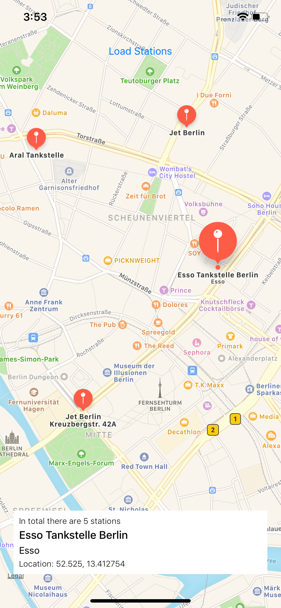

# :wave: iOS pair programming exercise

This is a simple clone of Bertha that does nothing but display a few
filling stations on a map. If you click on a marker, a little info box
is displayed.

The code has a few bugs and is not the most beautiful though – let's make it better!

## Running the project

1. Open the project in Xcode
2. Build & Run the application

## Troubleshooting

In the case that there are issues getting a response from the backend 
a mock JSON file is included in the project (`stations_response.json`).
